# CutScene

cutscene是对Timeline的一层封装，先了解Timeline和Cinemachine之后，再了解一下我们主要的存取方式，常用轨道即可

### Timeline

[官网文档链接](https://docs.unity3d.com/cn/2018.4/Manual/TimelineSection.html)看了文档后对与timeline的基本概念、基本操作都应该没问题了。

### Cinemachine

[官网链接](https://unity.com/cn/unity/features/editor/art-and-design/cinemachine)看完教程或者通过unity的packagemanager下载插件查看Example使用更佳

[别人的博客](https://blog.csdn.net/tanyu159/article/details/88608559)

### 以下是我们项目中的使用情况

### 核心代码

```
运行时MoonClient
CutScene/
├── MCutSceneAssetMgr.cs	预加载(部分)
├── MCutSceneData.cs	数据定义
├── MCutSceneHelper.cs 辅助类
├── MCutSceneMgr.cs		CutScene控制器，控制资源加载、状态切换
├── MCutsceneObject.cs 预加载封装
├── Shot 切片
│   ├── MAnimationShot.cs	自定义动画切片
│   ├── MBlackCurtainShot.cs 黑幕切片
│   ├── MCameraCullingShot.cs 相机裁剪&LOD切片
│   ├── MCvShot.cs Cv切片
│   ├── MEmotionBubbleShot.cs	气泡切片
│   ├── MEmotionShot.cs	表情切片
│   ├── MEntityOutlineShot.cs	描边切片
│   ├── MEntityScalerShot.cs	实体比例切片
│   ├── MFxParentShot.cs	特效父节点切片(有一些限制)
│   ├── MFxShot.cs	特效切片
│   ├── MHideShot.cs	显隐切片
│   ├── MImageShot.cs	2D图片切片
│   ├── MModelParentShot.cs 模型父节点切片
│   ├── MPostFxShot.cs	后处理切片
│   ├── MPostUberEffectShot.cs 后处理切片
│   ├── MSceneObjShot.cs	场景节点切片
│   ├── MShadowShot.cs 阴影切片
│   ├── MShakeScreenShot.cs 摇晃切片
│   ├── MStoryWordShot.cs 黑幕切片
│   ├── MWeatherShot.cs 天气&时间切片
│   └── MWordBubbleShot.cs 气泡切片
└── Track 轨道
    ├── MAnimationTrack.cs
    ├── MBlackCurtainTrack.cs
    ├── MCvTrack.cs
    ├── MEmotionBubbleTrack.cs
    ├── MEmotionTrack.cs
    ├── MFxParentTrack.cs
    ├── MFxTrack.cs
    ├── MHideTrack.cs
    ├── MImageTrack.cs
    ├── MModelParentTrack.cs
    ├── MPostFxTrack.cs
    ├── MPostUberEffectTrack.cs
    ├── MSceneObjTrack.cs
    ├── MShadowTrack.cs
    ├── MShakeScreenTrack.cs
    ├── MStoryWordTrack.cs
    ├── MWeatherTrack.cs
    └── MWordBubbleTrack.cs

编辑器代码
StoryTools/
├── Component
│   ├── BlackCurtainShotEditor.cs
│   ├── CutSceneModelDataEditor.cs
│   ├── EntityScalerEditor.cs
│   ├── ImageShotEditor.cs
│   ├── MFxParentShotEditor.cs
│   ├── MFxShotEditor.cs
│   ├── MModelParentShotEditor.cs
│   ├── MPostUberEffectShotEditor.cs
├── Component.meta
├── Preview
│   ├── PvwStoryData.cs
│   ├── PvwStoryEditor.cs
│   ├── PvwStoryLogic.cs
├── TimelineHelper.cs
├── Work
│   ├── StoryData.cs
│   ├── StoryEditor.cs
│   ├── StoryLogic.cs 编辑器核心类，负责编辑器下timeline的初始化和存储
│   ├── StoryVersionTranslate.cs

```

## 常见轨道

###  Track Group(轨道组)
用途：归类，方便管理
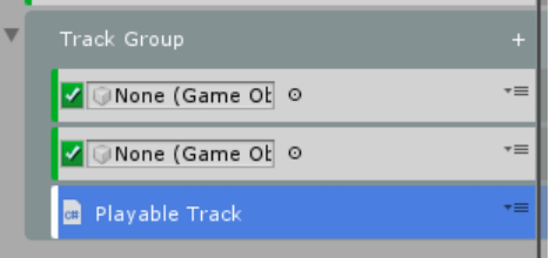

### Activation Track(显隐)
绑定关系:绑定控制的GO节点
#### 切片
控制GameObject节点显隐，时间轴对应的切片存在，显示；否则隐藏
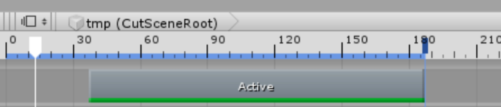

### Animation Track(动画)
绑定关系:绑定带Animator的GO节点
#### 切片
1. Infinite Clip 直接k帧，操作和Animation类似，也可以到对应的属性上右键Addkey
   
   可单向转换成动画切片，但无法反向转换

2. Animation Clip 使用游戏中现有动画资源，切片拖到轨道上即可
   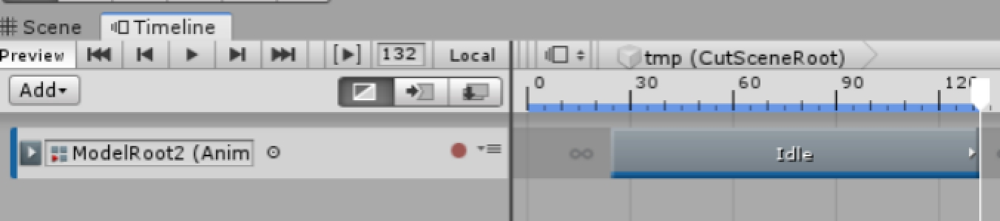
   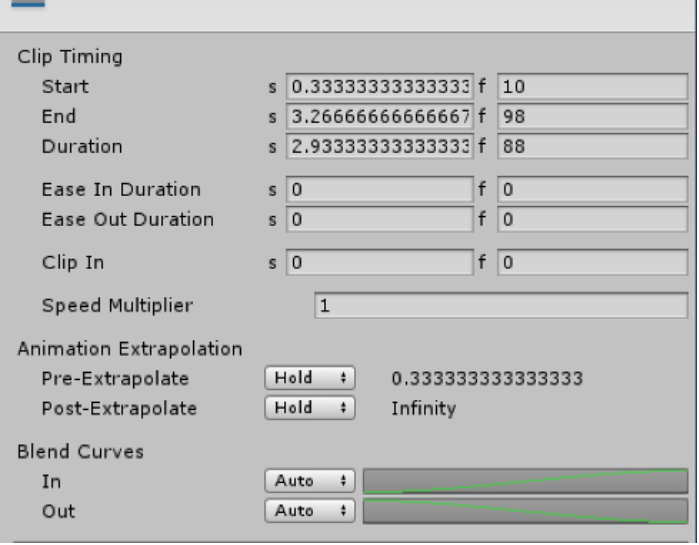
   Clip Timing为该切片的具体参数， s 代表单位是秒，f 代表单位是帧
   Start为切片开始、End为结束、Duration为时长
   Ease In Duration 渐入时间（如果和上一个切片存在融合，则此处无法编辑）
   Ease Out Duration 渐出时间（如果和上一个切片存在融合，则此处无法编辑）
   Clip In 偏移动画的开头
   Speed Multiplier 速率

#### 融合
多个切片相交即会产生融合，还可设置融合曲线
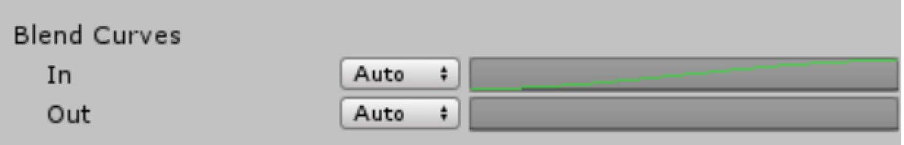

#### Animation Extrapolation
即以什么形式进入切片、以及出切片(默认是Hold)
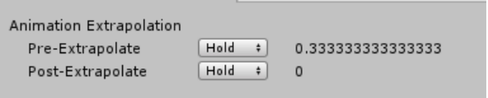

##### Pre

1. None:在所选动画剪辑之前的间隙中，GameObject 使用场景中的变换、状态.例如，如果要在场景中的"游戏对象"运动和动画剪辑之间创建缓入式，请选择"无"。有关详细信息，请参阅缓动和缓出剪辑

2. Hold:在所选动画剪辑之前的间隙中，绑定到动画轨道的游戏对象使用动画剪辑开头分配的值。

3. Loop:在所选动画剪辑之前的间隙中，绑定到动画轨道的"游戏对象"将整个动画作为前进循环重复：从头到尾。要偏移循环的开头，请使用"Clip In"属性

4. Pinpong:在所选动画剪辑前的间隙中，绑定到动画轨道的"游戏对象"向前重复整个动画，然后向后重复。使用"Clip In"属性偏移循环的开头。向前循环时更改"Clip In"属性会影响循环的开始，而向后循环时会影响循环的末尾。

5. Continue:在所选动画剪辑之前的间隙中，绑定到动画轨道的"游戏对象"将根据源资产的设置保留或循环动画。例如，如果所选动画剪辑使用运动文件"Record（2）"作为其源资产，并且"Record（2）"设置为"循环"，则选择"继续"将根据"Record（2）"循环时间设置循环动画。


##### Post
1. None:在所选动画剪辑后的间隙中，GameObject 使用场景中的变换、姿势或状态。例如，如果要在动画剪辑和场景中的"游戏对象"运动之间创建缓出，则选择"无"非常有用。有关详细信息，请参阅缓动和缓出剪辑
2. Hold:在所选动画剪辑之后的间隙中，绑定到动画轨道的游戏对象使用在动画剪辑末尾分配的值。
3. Loop:在所选动画剪辑后的间隙中，绑定到动画轨道的"游戏对象"将整个动画作为前进循环重复：从头到尾。要偏移循环的开头，请使用"Clip In"属性。
4. Pinpong:在所选动画剪辑后的间隙中，绑定到动画轨道的"游戏对象"向前重复整个动画，然后向后重复。使用"Clip In"属性偏移循环的开头。向前循环时更改"Clip In"属性会影响循环的开始，而向后循环时会影响循环的末尾。
5. Continue:在所选动画剪辑后的间隙中，绑定到动画轨道的"游戏对象"将根据源资产的设置保留或循环动画。例如，如果所选动画剪辑使用运动文件"Record（2）"作为其源资产，并且"Record（2）"设置为"循环"，则选择"继续"将根据"Record（2）"循环时间设置循环动画。

#### Override Track(动画片段覆盖)

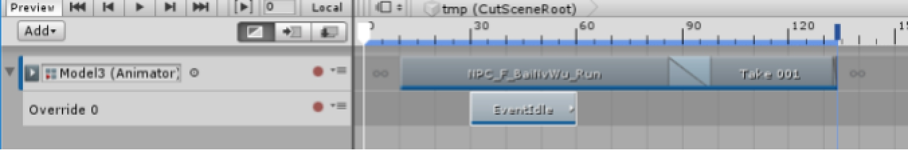

如上图，30-60帧之间的动画为OverrideTrack的动画

给OverrideTrack指定AvatarMask，可指定切片部分覆盖，可实现人物跑动但是上半身在欢呼动作的效果，具体覆盖部分看AvatarMask里设置
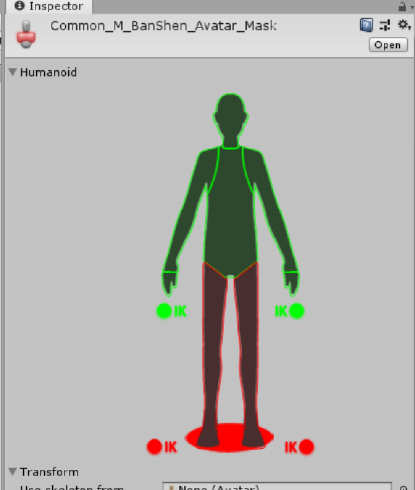
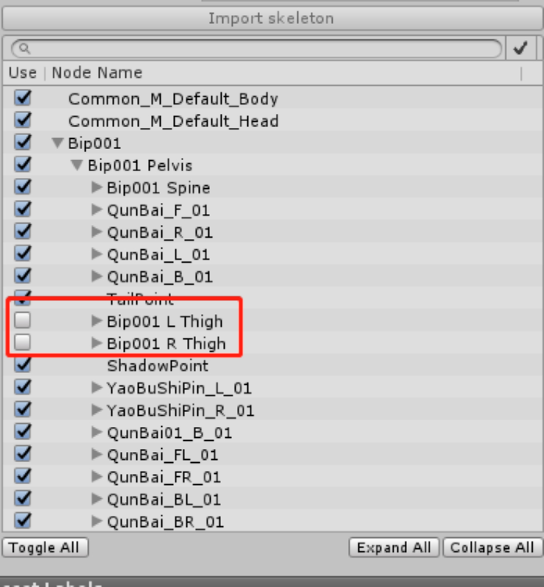

### Audio Track(音频)
项目不使用

### Control Track(控制和时间相关的GO、动画、特效等)
项目不使用

### Playable Track(未包含到轨道的PlayableAsset可通过此切片挂载)
1. MCgSpeedShot 控制时间流逝速率
- desSpeed 目标速率
- sGradually 插值
  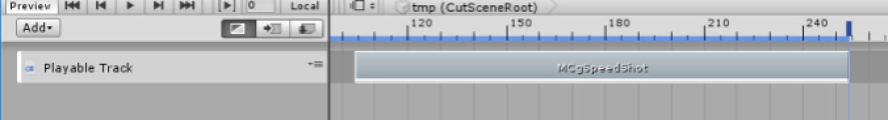

2. MLoopShot 切片内循环播放
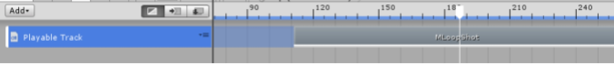

### FMOD Event Track(Fmod)
绑定关系:GameObject
##### 切片
传入Fmod的Event

### Spine Animation State Track
绑定关系:SkeletonAnimation组件

在hierarchy视图下的SpineRoot创建Spine节点(Sp1，Sp2....)，拖动此GO与轨道绑定，(如果没有对应的SkeletonAnimation组件，会提示自动加上)

##### 切片
SpineAnimationStateClip
红框内为引用动画资源
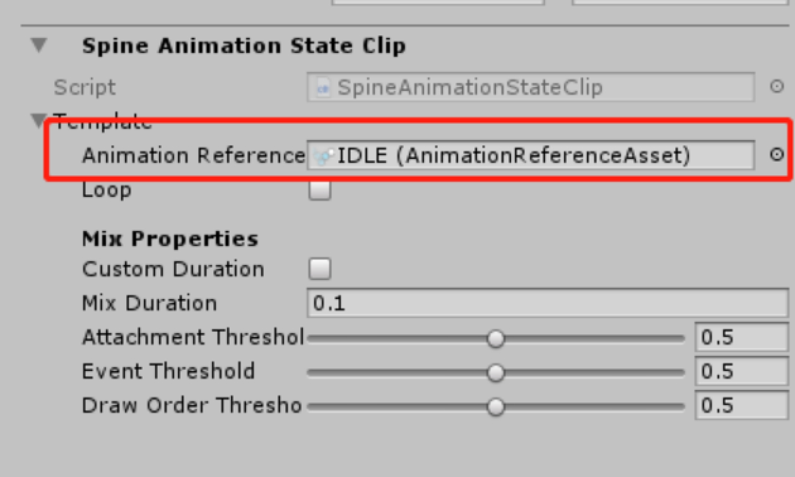
引用的资源一般用对应的Spine动画导出即可
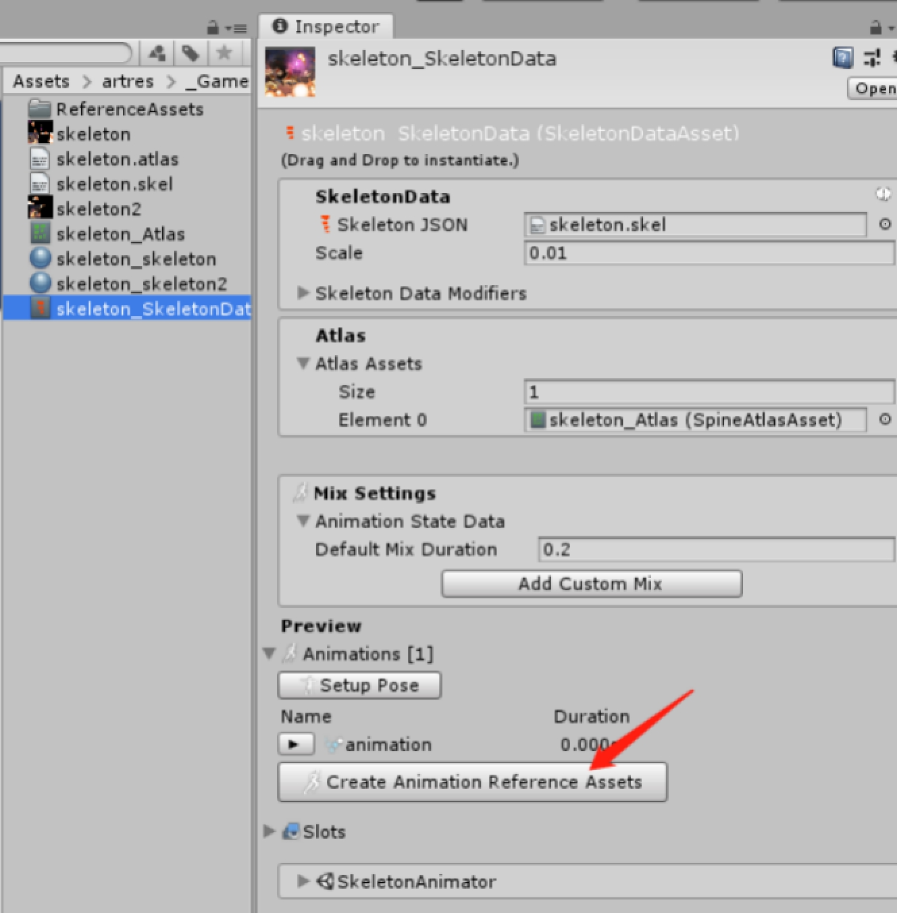

### Spine Skeleton Flip Track
绑定关系:SkeletonAnimationPlayableHandle组件

##### 切片
翻转X轴、翻转Y轴

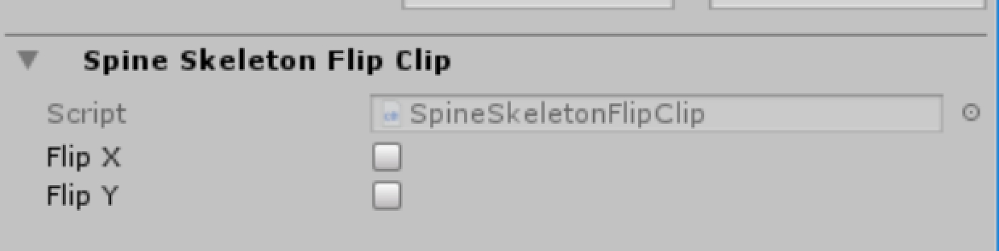

### Cinemachine Track
绑定关系:MainCamera、并且带CinemachineBrain组件

#### 切片
CinemachineShot
此相机将完全控制主相机，切片绑定的虚拟相机可通过修改参数实现正常游戏相机提供的所有功能，并且Cinemachine提供了非常强大的功能

- VirtualCamera
- 2DCamera 为相机增加一个边界，使相机不会出界
- BlendlistCamera 根据时间，切换不同的相机
- DollyCamera 轨道相机，相机只会在轨道上移动，根据Follow和LookAt动态调整相机位置
- DollyTrackWithCart 轨道物体，跟随轨道信息移动
- TargetGroupCamera
- FreeLookCamera 第三人称相机
- MixingCamera 生成的虚拟相机子物体还有两个虚拟相机，成像是两个子虚拟相机共同的结果
- ClearShotCamera 如果子相机具有CinemachineCollider扩展，他们将进行分析目标障碍场景，最佳目标距离等项目，并对其进行评估将镜头质量返回给ClearShot，然后他会选择最好的一个。如果多个子相机具有相同的镜头质量，则具有最高优先级的相机将是选择
- StateDrivenCamera激活特定镜头时进入特定的动画状态，结合Animator动画系统来使用具体可参照Cinemachine官方文档和Demo

## 扩展的轨道

### MAmimation Track(动画)
绑定关系:GameObject,不需要Animator
用法和AnimationTrack差不多，游戏运行时会动态绑定AnimatorOverrideController

### MBlackCurtainTrack(黑幕)
切片填写播放的BlackCurtainTable的Id、FadeIn、FadeOut时间

### MCV Track(对白)
绑定关系:无
切片填写对白ID(CutSceneTalkTable)

### MEmotionBubble Track(表情气泡)
- ModelId ： 模型索引
- EmoTableID: id(ShowExpressionTable)

### MEmotion Track(表情)
- Model Index : 模型索引
- EyeEmoId : 眼镜
- MouthEmoId : 牙
- FaceId : 脸

具体参数可找龙哥、超锅确认
最后会索引到一张贴图

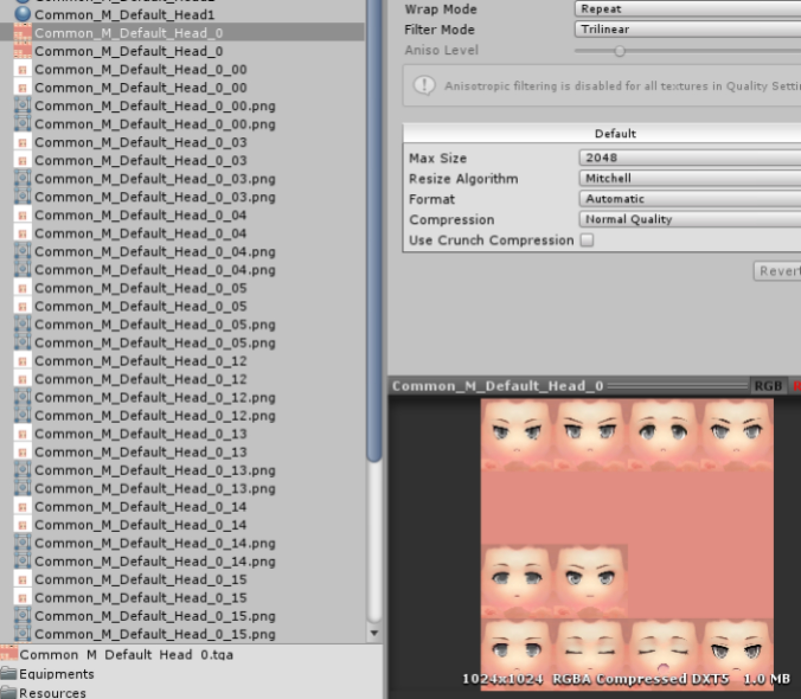

### MFx Track(特效)
特效ID:EffectTable的id
特效路径：在策划未配置表时，美术可使用
##### 初始
- position
- rotation
- scale
##### 挂载类型
1. NULL 无
2. Model 
- 模型索引
- 挂点类型：模型节点类型
  1. NULL
  2. BackPoint
  3. HelmetPoint
  4. TailPoint
  5. WeaponFx_L
  6. WeaponFx_R
  7. Root 挂载模型的同级节点

3. VirtualCamera
   - 虚拟相机索引
4. MainCamera
5. PostVolume 这个节点下

##### 特效Transform变换

切片期间，特效可进行变换

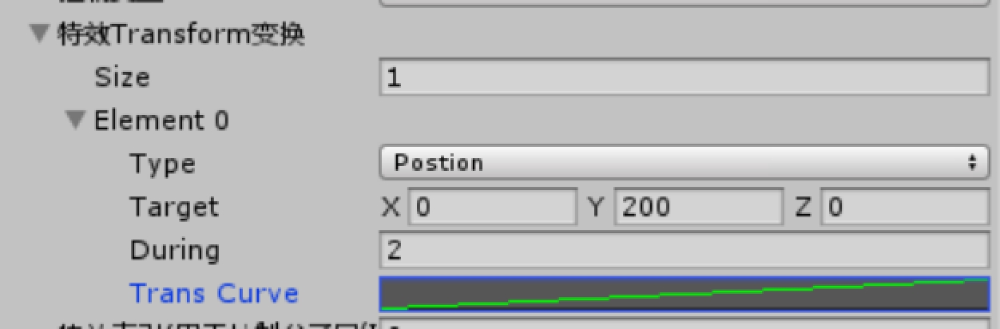

 

##### MHide Track(隐藏)

切片存在切剑隐藏对应的模型，切片结束后还原为显示状态

可选择永久隐藏

### MImage Track

### MPostFx Track(后处理)

具体参数参看后处理管线or问下超锅；一般使用后面的MPostUberEffectTrack可达到效果

### MPostUberEffect Track(后处理)

此轨道没有MPostFxTrack那么灵活，在原基础上进行了封装

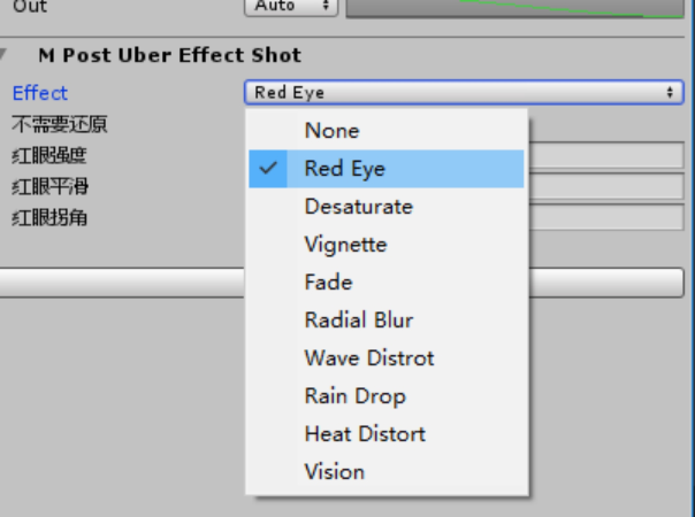

- RedEye：红眼
- Desaturate：褪色
- Vignette：暗角
- Fade：渐入渐出
- RadialBlur：径向
- WaveDistrot：水纹
- RainDrop：雨滴
- HeatDistort：热力
- Vision：幻想

### MSceneObj Track(场景物件)
给对应绑定了MSceneObjectEvent组件的物体发送事件

可控制场景物体播放动画，显隐

### MShadow Track(阴影)
显式指定阴影投射点

### MShakeScreen Track(相机晃动)
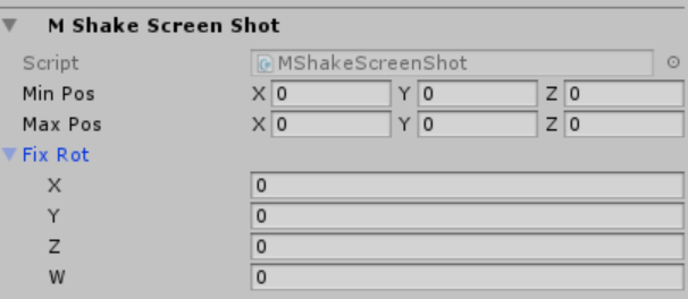
主相机在一定范围、角度抖动

### MStoryWork Track
废弃

### MWeather Track(天气)
若当前场景有对应天气配置，则可手动指定天气

### MWordBubble Track（气泡）
人物气泡显示对话内容(CutSceneTalkTable)


### PlayableTrack (承载其他切片)

### MEntityOutlineShot 实体描边控制(无描边、红色描边、黑色描边)

### MCameraCullingShot 相机裁剪、场景物件LOD控制

### MEntityScalerShot 实体Scale控制，用于控制实体比例变化


## 编辑器入口

Windows/剧情