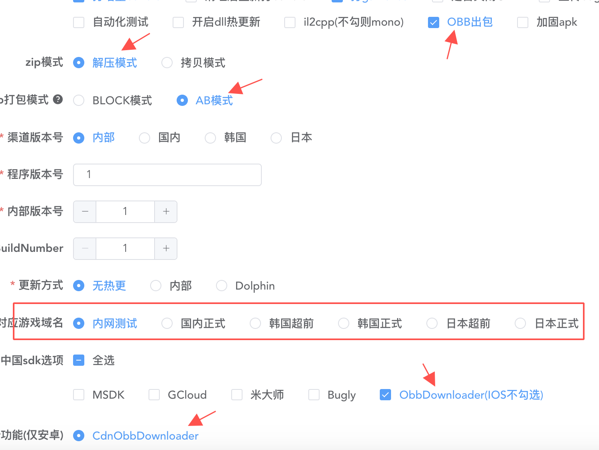
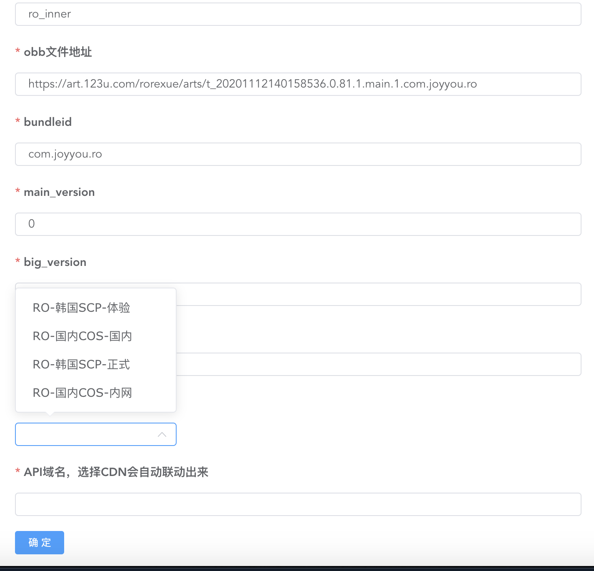

## PKG-SYSTEM是什么

pkgsystem是主要为了解决原先obb文件超过2G，等同于实现了一个小型的文件系统（提供各种之前使用的接口），并且在此基础上，我们加入了大包增量更新的逻辑。

比如0.1.0的版本存在100M的apk和一个1.5G的pkg资源文件，在更新大版本0.2.0的时候，只需要跟新一个100M的apk和一个与0.1.0差异的资源包文件

## OBB&PKG

核心逻辑是从apk剥离资源，原先unity打小包方式是

```c#
PlayerSettings.Android.useAPKExpansionFiles = true;
```

unity会自动剥离非初始场景的资源并生成obb文件

而这里，我们需要手动实现这个过程，如果之前项目就已经集成生成ab的流程，这里就会比较方便，即将生成的ab合并成pkg，而apk就只需要必备资源即可，100M绰绰有余。

我们项目ab或其他的资源文件会统一放到一个ab工程中，通过一定的规则将这些资源合并起来即可。

## PKG的组成

根据我们项目，资源分为以下几类

1. lua文件、bytes文件(各种配置文件)
2. ab
3. movie
4. fmod
5. photo(照片墙)

那么就有枚举

```c#
public enum PkgEntryType
{
    // 默认 0
    Default,
    // robytes，1
    Bytes,
    // robytes，转换为Bytes进包 2
    Lua,
    // ab 3
    AB,
    // fmod bank 4
    FMod,
    // mp4 5
    Movie,
    // 已失效 6
    ByteBlock,
    // 照片墙 7
    Photo,
}
```

##### pkg文件的组成结构

```
pkg
├─headeroffset(int64)指向pkg文件头位置
├─资源1
├─资源2
├─...
...
├─index(byte) 当前版本第几个pkg文件
├─total(byte) 当前版本共存在多少个pkg文件
├─pkgversion(int32) pkg版本
├─patchversion(int32) patch版本，如果patch版本和pkg版本不一致，代表这是一个增量pkg
├─entrycount(int32) Entry头数量
├─Entry头1
├─Entry头2
...
└─Entry头N
```


##### PKG版本号

pkg版本号跟随着apk一起，比如当前我打包1.5.1的apk，那么当前会打出一个(或多个)1.5.1的pkg资源包，命名上为ro_1.5.1_x.pkg

当下次生成1.6.2的apk时，会生成1.6.2的主pkg，并且同时生成1.5.1->1.6.2的patch包，命名为ro_1.5.1_1.6.2.pkg

此版本号也一并存入了pkg文件中，我这里使用了一个int32的数来存储1.5.2这个信息。这里使用了从末尾起算的24位。

```c#
public static int TranslateVersion2Int32(MVersion version)
{
	var v1 = (version.ChannelVersion << 16) + (version.ProgramVersion << 8) + version.InnerVersion;
	return v1;
}
public static MVersion GetVersion(int version)
{
  var b1 = (byte)((version >> 16) & 0xFF);
  var b2 = (byte)((version >> 8) & 0xFF);
  var b3 = (byte)((version >> 0) & 0xFF);

  return new MVersion(b1, b2, b3, 0);
}
```

这样，每个pkg版本被唯一确定并写入了文件中，在后面验证pkg完整性和patch原始资源到apk版本有用到。

对于每一个资源，有如下文件头定义

```c#
public class MPkgEntry
{
    // Pkg资源名
    public string Name;
    // Pkg资源类型
    public PkgEntryType Type;
    // MD5
    public byte[] Md5;
    // Pkg资源所在偏移
    public long ContentOffset;
    // Pkg资源长度
    public long ContentLength;
    // 文件索引
    public byte Index;
}
```

头信息指定了文件索引(多个文件)、资源类型(分不同类型做加载or解压)、资源md5(主要用于生成增量)、资源名、ContentOffset(该资源所存在的pkg的文件偏移量)、ContentLength(该资源大小)

## PKG生成

#### PkgConsole

pkg生成基于.net core3.1

具体可参考clientcode/ToolsProject/PkgConsole工程

核心代码为:

1. PkgInputStream 定义了编辑器下读取pkg的方法
2. PkgOutputStream 定义了编辑器下输出单个pkg的方法
3. PkgMultipleInputStream 定义了编辑器下读取多个pkg的方法
4. PkgMultipleOutputStream 定义了编辑器下输出多个pkg的方法
5. Program 定义了输入参数解析和周转

#### PkgWindow

依赖于PkgConsole，基于wpf，做的一个简单的可视化界面，用于查看pkg信息

通过shell调用接口生成即可，示例如下：

```shell
dotnet clientproj/Tools/PkgConsole/PkgConsole.dll --create roab/${platform} ${EnvBakDir}/publish/t_${intra_ver}.${main_version}.${big_version}.${inner_version}.main.${version_code}.${bundle_id} ${main_version}.${big_version}.${inner_version}
```


## 运行时PKG读取

##### 初始化

1. 获取PKG存储路径 Android/obb/bundleId/ 

   ```c#
    public static string ObbPath
    {
        get
        {
            if (m_isObbInited)
            {
                return m_obbPath;
            }

    #if UNITY_ANDROID
            
            AndroidJavaClass unityPlayer = new AndroidJavaClass("com.unity3d.player.UnityPlayer");
            AndroidJavaObject currentActivity = unityPlayer.GetStatic<AndroidJavaObject>("currentActivity");
            m_obbPath = currentActivity.Call<string>("GetObbPath");
    #else
            m_obbPath = $"{PersistentDataPath}/pkg";

    #endif
            if (!string.IsNullOrEmpty(m_obbPath))
            {
                m_isObbInited = true;
            }

            return m_obbPath;
        }
    }
   ```

   

2. 获取目录下所有pkg，并且读取pkg关键信息，整理出pkg列表和patch列表

   ```c#
    var files = Directory.GetFiles(_fileDirectory, "*.pkg", SearchOption.TopDirectoryOnly);
    foreach (var t in files)
    {
        readHeader(t, fullAnalysis, out var pkgInfo);
        if (pkgInfo.PkgVersion.Equals(pkgInfo.PatchVersion)) _mainPkgList.Add(pkgInfo);
        else _patchPkgList.Add(pkgInfo);
    }
   
    private void readHeader(string filePath, bool fullAnalysis, out MPkgHeaderInfo pkgInfo)
    {
        pkgInfo = new MPkgHeaderInfo();
        pkgInfo.FilePath = filePath;
        using (var fs = new FileStream(filePath, FileMode.Open, FileAccess.Read, FileShare.Read))
        {
            using (var br = new BinaryReader(fs, Encoding.UTF8))
            {
                getPkgInfo(br, ref pkgInfo);
                Log($"readHeader--> filePath:{filePath} header.PkgVersion:{pkgInfo.PkgVersion.To3String()} header.PatchVersion:{pkgInfo.PatchVersion.To3String()} entryCount:{pkgInfo.EntryCount} index:{pkgInfo.Index} total:{pkgInfo.Total}");
                if (!fullAnalysis) return;
                pkgInfo.Header = new Dictionary<PkgEntryType, Dictionary<string, MPkgEntry>>();
                for (int i = 0; i < pkgInfo.EntryCount; i++)
                {
                    var entry = readHeader(br);
                    if (entry == null) continue;

                    if (!pkgInfo.Header.TryGetValue(entry.Type, out var group))
                    {
                        group = new Dictionary<string, MPkgEntry>();
                        pkgInfo.Header.Add(entry.Type, group);
                    }

                    group.Add(entry.Name, entry);
                }
            }
        }
    }
   ```

3. 剔除名称和版本对不上的pkg(减少一部分复杂度)

   ```c#
    private void deleteUnMatchPkg()
    {
        deleteUnMatchPkg(_mainPkgList);
        deleteUnMatchPkg(_patchPkgList);
    }
   ```

   

4. 检查主pkg是否完整(原则上完整的主pkg只能存在一份，可存在多个patch，链路到apk版本)

   1. 删除与Apk版本不一致的pkg
      ```c#
        private void deleteUnMatchApkVersionPkg()
        {
            for (int i = _mainPkgList.Count - 1; i >= 0; i--)
            {
                var pkgVersion = _mainPkgList[i].PkgVersion;
                if (pkgVersion.ChannelVersion == ApkVersion.ChannelVersion &&
                    CompareVersion(pkgVersion, ApkVersion) <= 0) continue;
                Log($"checkMainPkg 与ApkVersion不匹配 apkVersion:{ApkVersion} pkgVersion:{pkgVersion}");
                if (DeleteWhenDisMatch)
                {
                    File.Delete(_mainPkgList[i].FilePath);
                }
                _mainPkgList.RemoveAt(i);
            }
        }
      ```

      

   2. 获取最高版本的pkg

      ```c#
        private MVersion getMaxMainPkgVersion(out byte total)
        {
            MVersion v = null;
            total = 0;
            for (int i = 0; i < _mainPkgList.Count; i++)
            {
                if (v == null || (CompareVersion(_mainPkgList[i].PkgVersion, v) > 0))
                {
                    v = _mainPkgList[i].PkgVersion;
                    total = _mainPkgList[i].Total;
                }
            }

            return v;
        }
      ```
   
      
   
   3. 剔除选定pkg之外的主pkg
   
   4. 如果发现缺失主pkg，记录，用于之后patch判定或者重新下载
   
5. 如果前面主pkg已经完整并且和apk版本一致，直接跳过；否则进行patch资源包的检查

   1. 对patch列表进行排序，以pkgversion为依据

   2. 从主pkg开始探索能链接到的最终版本号，比如：

      存在apk1.5.2

      包里存在pkg:1.3.1(主)、1.3.1-1.4.2、1.3.1-1.4.1、1.4.2-1.5.2、1.4.1-1.5.1

      那么能够搜索出来的结果为

      1. 1.3.1->1.4.2->1.5.2
      2. 1.3.1->1.4.1->1.5.1

      最终采取最接近apk1.5.2的链路。

      以下是搜索代码，这里把版本号转换成一个int方便判定，使用了一个栈来存储路径
   
      ```c#
        private int travelPatchList(out List<Tuple<int, int>> final)
        {
            var dic = getTravelMap();
            var pkgVersionNum = TranslateVersion2Int32(PkgVersion);
            var apkVersionNum = TranslateVersion2Int32(ApkVersion);
            var tmpStack = new List<Tuple<int, int>>();
            var ret = pkgVersionNum;
            var bestRecord = new List<Tuple<int, int>>();

            void markBestRecord(int reachVersionNum)
            {
                if (reachVersionNum > ret)
                {
                    bestRecord.Clear();
                    bestRecord.AddRange(tmpStack);
                    ret = reachVersionNum;
                    Log($"mark best way {bestRecord.ConverToString()}");
                }
            }
            void search(int start)
            {
                markBestRecord(start);
                if (start == apkVersionNum)
                {
                    return;
                }

                if (!dic.TryGetValue(start, out var canReachGroup))
                {
                    return;
                }
                for (int i = 0; i < canReachGroup.Count; i++)
                {
                    var v = canReachGroup[i];
                    var t = new Tuple<int, int>(start, v);
                    int index = tmpStack.Count;
                    tmpStack.Add(t);
                
                    search(v);
                    tmpStack.RemoveAt(index);
                }
            }

            if (dic.TryGetValue(pkgVersionNum, out var startGroup))
            {
                for (int i = 0; i < startGroup.Count; i++)
                {
                    tmpStack.Clear();
                    tmpStack.Add(new Tuple<int, int>(pkgVersionNum, startGroup[i]));
                    search(startGroup[i]);
                }
            }

            final = new List<Tuple<int, int>>(bestRecord);
            if (DeleteWhenDisMatch)
            {
                deleteUnUsedPatch(final);
            }

            return ret;
        }
      ```

      
   
   3. 如果上诉遍历未达到apk版本，说明本地资源缺失，需要下载

##### 读取

1. ab

   ```c#
    public AssetBundleCreateRequest LoadFromFileAsync(string path, uint crc)
    {
        var group = getEntryGroup(PkgEntryType.AB);
        if (group == null)
        {
            Error($"LoadFromFileAsync 未找到Group");
            return null;
        }

        if (!group.TryGetValue(path, out var e))
        {
            Error($"LoadFromFileAsync 未找到Entry path:{path}");
            return null;
        }

        if (e.Index >= _pkgPaths.Count)
        {
            Error($"LoadFromFileAsync Entry索引文件越界 Index:{e.Index} Count:{_pkgPaths.Count}");
            return null;
        }
        return AssetBundle.LoadFromFileAsync(_pkgPaths[e.Index], crc, (ulong)e.ContentOffset);
    }
   ```

2. bytes(这块为了减少mono内存，在c++里)

   在pkg模式下，接管原先的bytes读取逻辑；c++端的加载代码和c#类似

   ```c++
        unsigned char* MPkgMgr::internalReadFile(const MPkgEntry* bai, long& len)
        {
            if (bai == nullptr)
            {
                return nullptr;
            }

            // uint8_t实际上是一个char。输出uint8_t类型的变量实际上输出其对应的字符，而不是数值，所以在这里用format(%u)来强制输出数字(bai->file_id)
            char block_path[256];
            snprintf(block_path, 256, "%s", pkgList[bai->index].c_str());

            bool is_asset;
            FILE* file = mOpenFile(block_path, "rb", is_asset);
            if (file == nullptr)
            {
        #ifdef ANDROID
                LOGE("[MFileMgr::readBytesBlock]打开BLOCK文件失败, 路径=%s", block_path);
        #endif
                return nullptr;
            }

            auto* p_data = (unsigned char*)malloc(bai->length);
            if (!p_data)
            {
                fclose(file);
        #ifdef ANDROID
                LOGE("[MFileMgr::ReadFile]内存不够, 文件路径=%s, 尝试分配内存=%ld!", block_path, bai->length);
        #endif
                return nullptr;
            }
            fseek(file, bai->offset, SEEK_SET);

            if (fread(p_data, 1, bai->length, file) != (size_t)bai->length)
            {
                fclose(file);
                free(p_data);
        #ifdef ANDROID
                LOGE("[MFileMgr::readBytesBlock]读取BLOCK文件失败, 路径=%s, offset=%u, read length=%u", block_path, bai->offset, bai->length);
        #endif
                return nullptr;
            }
            len = bai->length;
            fclose(file);

            return p_data;
        }
   ```

   

3. fmod&movie，由于fmod和avpro不支持指定流加载，需要解压出来

   解压无非是根据前面的pkg头信息，将文件的一部分另存为文件即可。

4. photowall(dc当初集成了pngloader，c++传一个指针即可)

   ```c++
    JNIEXPORT bool JNICALL LoadWithPath(PngLoader *pPngLoader, char* fileName){
        if(fileName == nullptr){
            return false;
        }

        long len;
        uint8_t* pData = g_bbmgr.ReadFile(fileName, len);
        if (pData == nullptr)
        {
            return false;
        }

        Load(pPngLoader, pData, static_cast<size_t>(len));
        delete[] pData;
        return true;
    }
   ```

   

## 下载

下载使用java实现，并且可以后台下载，参考代码ObbDownloader.java

```java
package com.joyyou.rosdk;

import android.content.Context;
import android.os.Bundle;
import android.util.JsonReader;

import com.google.android.vending.expansion.downloader.impl.DownloadInfo;
import com.google.android.vending.expansion.downloader.impl.DownloadsDB;
import com.joyyou.rosdk.MainActivity;
import com.joyyou.rosdk.SDKManager;
import com.joyyou.rosdk.define.ISDK;
import com.joyyou.rosdk.define.NotifyMethodDefine;
import com.joyyou.rosdk.define.SDKEventDefine;
import com.joyyou.sdk.JoyyouProxy;
import com.tencent.xg.trydyload_api.TryDyLoader;
import com.unity3d.plugin.downloader.DownloaderClient;
import com.unity3d.plugin.downloader.UnityDownloaderService;

import org.json.JSONException;
import org.json.JSONObject;

import java.util.function.ToIntFunction;

public class ObbDownloader extends ISDK {
    DownloaderClient downloaderClient;
    @Override
    public void OnCreate(Bundle savedInstanceState) {
        Context context = SDKManager.GetInstance().CurrentActivity.getApplicationContext();
        downloaderClient=new DownloaderClient(context, MainActivity.class, new DownloaderClient.ObbDownloaderCallback() {
            @Override
            public void onDownloadProgress(DownloaderClient.DownloadProgress downloadProgress) {
                try{
                    JSONObject jsonObject=new JSONObject();
                    JSONObject data=new JSONObject();
                    data.put("overallTotal",downloadProgress.mOverallTotal);
                    data.put("overallProgress",downloadProgress.mOverallProgress);
                    data.put("timeRemaining",downloadProgress.getTimeRemainingStr());
                    data.put("currentSpeed",downloadProgress.mCurrentSpeed);
                    jsonObject.put("state","Downloading");
                    jsonObject.put("data",data.toString());
                    SDKManager.GetInstance().MessageNotify(NotifyMethodDefine.ObbDownloaderCallBack, jsonObject.toString());
                }catch (JSONException e)
                {
                    e.printStackTrace();
                }
            }

            @Override
            public void onDownloadStateChange(int newState) {
                try{
                    JSONObject jsonObject=new JSONObject();
                    jsonObject.put("state","DownloadStateChange");
                    jsonObject.put("data",String.valueOf(newState));
                    SDKManager.GetInstance().MessageNotify(NotifyMethodDefine.ObbDownloaderCallBack, jsonObject.toString());
                }catch (JSONException e)
                {
                    e.printStackTrace();
                }
            }
        });
//        DownloadsDB.getDB(context).AddNewDownload(new DownloadInfo(
//                0,"1.pkg","https://art.123u.com/rorexue/arts/t_20200806174909665.apk",2127280862L,"a755cd2b3916b5c0014df0b37f71e107"));
//        DownloadsDB.getDB(context).AddNewDownload(new DownloadInfo(
//                0,"2.pkg","https://art.123u.com/rorexue/arts/t_20200806191842255.apk",2154055938L,"a1078f15dc322adb026420ef7b760aa8"));
//        downloaderClient.StartDownload();
    }


    public void CallNativeVoidFunc(String eventName, String data)
    {
        if(eventName.equals(SDKEventDefine.SDK_EVENT_START_DOWNLOAD_OBB))
        {
            SDKManager.GetInstance().ULog(SDKEventDefine.SDK_EVENT_START_DOWNLOAD_OBB);
            StartDownload();
        }
        else if(eventName.equals(SDKEventDefine.SDK_EVENT_PAUSE_DOWNLOAD_OBB))
        {
            SDKManager.GetInstance().ULog(SDKEventDefine.SDK_EVENT_PAUSE_DOWNLOAD_OBB);
            PauseDownload();
        }
        else if(eventName.equals(SDKEventDefine.SDK_EVENT_CONTINUE_DOWNLOAD_OBB))
        {
            SDKManager.GetInstance().ULog(SDKEventDefine.SDK_EVENT_CONTINUE_DOWNLOAD_OBB);
            ContinueDownload();
        }
        else if(eventName.equals(SDKEventDefine.SDK_EVENT_ENABLE_DOWNLOAD_WITHOUT_WIFI))
        {
            SDKManager.GetInstance().ULog(SDKEventDefine.SDK_EVENT_ENABLE_DOWNLOAD_WITHOUT_WIFI);
            EnableDownloadWithoutWifi();
        }
        else if(eventName.equals(SDKEventDefine.SDK_EVENT_ENABLE_NOTIFY_DOWNLOAD_STATE))
        {
            SDKManager.GetInstance().ULog(SDKEventDefine.SDK_EVENT_ENABLE_NOTIFY_DOWNLOAD_STATE);
            NotifyDownloadState(data);
        }
        else if(eventName.endsWith(SDKEventDefine.SDK_EVENT_SET_USE_CDN)){
            SDKManager.GetInstance().ULog(SDKEventDefine.SDK_EVENT_SET_USE_CDN);
            SetUseCdn(data);
        }
    }

    public void SetUseCdn(String jsonData){
        try {
            Context context = SDKManager.GetInstance().CurrentActivity.getApplicationContext();
            SDKManager.GetInstance().ULog(jsonData);
            JSONObject jsonObject = new JSONObject(jsonData);
            boolean useCdn = jsonObject.getBoolean("useCdn");
            String url = jsonObject.getString("url");
            long fileSize=jsonObject.getLong("fileSize");
            String fileMd5=jsonObject.getString("fileMd5");
            String fileName = jsonObject.getString("fileName");
            DownloadsDB.getDB(context).AddNewDownload(new DownloadInfo(
                    0,fileName,url,fileSize,fileMd5));
        } catch (JSONException e) {
            e.printStackTrace();
        }
    }

    public  void NotifyDownloadState(String jsonData){
        try {
            SDKManager.GetInstance().ULog(jsonData);
            JSONObject jsonObject = new JSONObject(jsonData);
            int newState = jsonObject.getInt("newState");
            String info = jsonObject.getString("stateInfo");
            downloaderClient.NotifyDownloadState(newState,info);
        } catch (JSONException e) {
            e.printStackTrace();
        }

    }

    public void EnableDownloadWithoutWifi()
    {
        UnityDownloaderService unityDownloaderService=new UnityDownloaderService();
        unityDownloaderService.setDownloadFlags(1);
    }

    public  void OnResume()
    {
        downloaderClient.onResume();
    }
    public  void OnStop()
    {
        downloaderClient.onStop();
    }
    public  void StartDownload()
    {
        if(downloaderClient!=null){
            downloaderClient.StartDownload();
        }
    }

    public  void PauseDownload()
    {
        if(downloaderClient!=null){
            downloaderClient.PauseDownload();
        }
    }

    public  void ContinueDownload()
    {
        if(downloaderClient!=null){
            downloaderClient.ContinueDownload();
        }
    }


}

```

注意，由于使用了sqlite，如果表有变化，记得升级数据库的版本！


## 工作流

1. 进入打包页面，务必选择如图所示几个箭头指向的选项，红框的域名需要记一下，在后面上传pkg时有用



2. 打包完成后，在pkg列表标签可以找到刚才打的pkg，点击上传，这里只需要选择cdn，和前面打包选择的域名时一一对应的
3. 

​      

3. 上传结束后apk即可下载对应的资源包

#### 备注

如果下载失败之类的，可通过下面链接快速定位

https://{域名}/pkg/file-info?channel_code={渠道}&bundleid={包名}&version_code={BuildNumber}&apk_version={安装包三位版本}&pkg_version={pkg三位版本，只在客户端存在完整主pkg的时候需要传}&game_code=ro

示例：https://ro-client-api-ready.huanle.com/pkg/file-info?channel_code=ro_inner&bundleid=com.joyyou.ro&version_code=1&apk_version=0.81.2&pkg_version=&game_code=ro

response：

```json
{"code":200,"message":"success","current_time":1605168146,"data":[{"url":"https://ro-1251001122.cos.ap-shanghai.myqcloud.com/obb/ro/0/ro_inner/com.joyyou.ro/81.2/f2c0c15c2670c1e6b7fb6e3100cd5c3ba3cf0f66.pkg","file_size":1611532470,"file_hash":"f2c0c15c2670c1e6b7fb6e3100cd5c3ba3cf0f66","type":"pkg","version":"0.81.2_0"},{"url":"https://ro-1251001122.cos.ap-shanghai.myqcloud.com/obb/ro/0/ro_inner/com.joyyou.ro/81.2/593a0c716f1fafb3f0c2943e769931586eba973d.pkg","file_size":830833613,"file_hash":"593a0c716f1fafb3f0c2943e769931586eba973d","type":"pkg","version":"0.81.2_1"}]}
```


